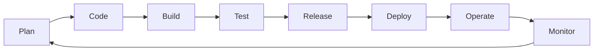

# SDLC & DevOps Foundations

> Status: 🔲 skeleton

## Overview
_TODO: What is the SDLC, and where/why does DevOps insert itself into it._

## Diagram

_TODO: Replace with an annotated version once content is drafted (e.g., highlight where CI/CD automates which stages)._

## How It Works

### SDLC Models
- Waterfall
- Iterative / Agile
- Spiral
- V-Model

### Agile & Scrum Basics
- Sprints, backlog, standups, retros
- Kanban vs Scrum

### CALMS Framework (the pillars of DevOps culture)
- Culture
- Automation
- Lean
- Measurement
- Sharing

## Common Tools
| Tool | Use Case |
|------|----------|
| Jira / Linear | Backlog & sprint tracking |
| Confluence / Notion | Documentation |

## Gotchas / Interview Angle
- "DevOps is a culture, not a job title" — be ready to explain why
- Difference between Agile and DevOps (commonly confused)
- Seed Q: "Walk me through the SDLC and where DevOps practices reduce friction at each stage."

## References
- _TODO_
