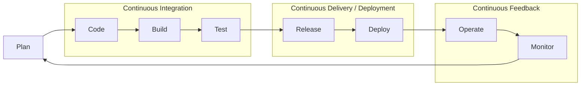

# SDLC & DevOps Foundations

> Status: ✅ complete

## Overview

The **Software Development Life Cycle (SDLC)** is the structured sequence of stages software moves through from an idea to something running in front of users: planning what to build, writing it, verifying it works, shipping it, and keeping it running. Every team follows *some* SDLC whether they name it or not — the question is how deliberately, and how much friction sits between each stage.

**DevOps isn't a stage you insert into the SDLC — it's a set of practices and cultural changes that act on the whole cycle at once.** Where a classic SDLC treats "Dev" (plan/code/build/test) and "Ops" (release/deploy/operate/monitor) as two teams handing work across a wall, DevOps collapses that wall: the people who write the code also own getting it running and keeping it healthy, the handoffs are automated instead of ticketed, and the feedback from production flows straight back into planning instead of getting lost. Concretely, that shows up as CI pipelines instead of manual build steps, infrastructure-as-code instead of hand-configured servers, and dashboards/alerts instead of "operations finds out when it breaks."

This chapter is the foundation the rest of the book builds on: the SDLC models you'll hear referenced constantly, the Agile vocabulary that shows up in every planning meeting, and CALMS — the framework most commonly used to describe what "DevOps culture" actually consists of.

## Diagram

The loop matters as much as the stages: **Monitor feeds back into Plan.** A classic SDLC often stops thinking once software ships; DevOps treats production telemetry — error rates, latency, user behavior, incidents — as direct input to the next planning cycle. CI automates Code→Build→Test into one pipeline that runs on every commit; CD automates Release→Deploy so shipping is a routine, low-drama event rather than a quarterly ceremony.

## How It Works

### SDLC Models

- **Waterfall** — fully sequential: each phase (requirements → design → implementation → verification → maintenance) completes before the next begins, with formal sign-off at each gate. It's rigid to change mid-flight, but the paper trail and predictability are exactly why it still shows up in regulated or contractually fixed-scope work.
- **Iterative / Agile** — build in short cycles, ship working (if incomplete) software early, and let real feedback reshape the backlog instead of trying to nail every requirement upfront. This is the dominant model in most modern software teams, and it's the model DevOps practices layer most naturally onto.
- **Spiral** — a risk-driven model that repeats four phases (determine objectives → identify and resolve risks → engineer the next prototype → plan the next iteration) in a loop, spending real effort on risk analysis before each pass. Common in large, complex, high-stakes systems where an unmanaged risk is expensive to discover late.
- **V-Model** — an extension of Waterfall where every development phase has a *corresponding, explicit* testing phase (unit tests mirror implementation, integration tests mirror design, acceptance tests mirror requirements). Popular where traceability from requirement to test case is a compliance requirement — aerospace, medical devices, automotive.

### Agile & Scrum Basics

Agile teams organize work into **sprints** — fixed-length iterations, typically one to four weeks, at the end of which the team should have something shippable. A **backlog** holds everything not yet started, roughly prioritized and periodically **refined** (broken down, estimated, clarified) so the highest-priority items are ready to pull into the next sprint. Two ceremonies do most of the heavy lifting: the **daily standup** (a short sync — what I did, what I'm doing, what's blocking me) keeps the team aligned without a meeting-heavy overhead, and the **retrospective** at the end of each sprint is where the team explicitly asks what to keep, stop, or change — the mechanism that makes a process actually improve over time instead of calcifying.

**Scrum vs Kanban** is the framework-level choice most teams eventually make explicit:

- **Scrum** is time-boxed: fixed-length sprints, a fixed set of roles (Product Owner owns *what*, Scrum Master owns *how the process runs*, the dev team owns *building it*), and a fixed ceremony cadence (planning, standup, review, retro).
- **Kanban** is flow-based, not time-boxed: work is visualized on a board, pulled (not pushed) by whoever has capacity, and constrained by explicit **WIP (work-in-progress) limits** per column so the team never has more in flight than it can actually finish. There's no sprint boundary — work ships continuously as each item clears the board.

Neither is "more DevOps" than the other; they're project-management choices that sit alongside DevOps practices rather than substituting for them.

### CALMS Framework (the pillars of DevOps culture)

CALMS is the most commonly cited breakdown of what "DevOps culture" is actually made of:

- **Culture** — shared ownership between the people who build software and the people who run it; blameless postmortems (the incident review asks "what in our system let this happen," not "who broke it") so people report problems early instead of hiding them.
- **Automation** — anything done by hand repeatedly is a bug waiting to happen. Builds, tests, deployments, and infrastructure provisioning get automated first, freeing humans for the judgment calls machines can't make.
- **Lean** — borrowed from lean manufacturing: minimize work-in-progress, ship in small batches (a smaller change is easier to review, test, and roll back), and map the value stream to find where work actually sits idle waiting on a handoff.
- **Measurement** — you can't improve what you don't measure. This is where the **DORA metrics** come in (from Google's DevOps Research and Assessment program): **deployment frequency**, **lead time for changes**, **change failure rate**, and **time to restore service (MTTR)**. DORA's research finding that gets quoted constantly: elite-performing teams score well on *both* speed and stability at once — it's not actually a tradeoff.
- **Sharing** — knowledge, tooling, and responsibility spread across teams instead of pooling in silos or a single "hero" engineer; internal documentation and shared platforms exist specifically to make expertise something the whole org has, not something that walks out the door with one person.

## Common Tools

| Tool | Use Case |
|------|----------|
| Jira / Linear | Backlog & sprint tracking |
| Confluence / Notion | Documentation and runbooks |
| GitHub Projects / GitLab Boards | Lightweight Kanban tied directly to code |
| Miro / FigJam | Retro boards, value-stream mapping |
| PagerDuty / Opsgenie | On-call and incident response, closing the Monitor → Plan loop |

## Gotchas / Interview Angle

- **"DevOps is a culture, not a job title."** Be ready to explain *why* that's more than a slogan: a "DevOps engineer" who's really just a rebranded sysadmin, sitting in a silo the same way Ops always did, hasn't changed anything — the practices only work when the culture (shared ownership, blameless postmortems) changes too.
- **Agile and DevOps get conflated constantly, and they're not the same thing.** Agile is about *how you plan and build* software (iterative, feedback-driven). DevOps is about *how you ship and run* it (automation, shared ownership across dev/ops, continuous feedback from production). A team can run textbook Scrum and still deploy manually once a quarter — that's Agile without DevOps.
- **Running Scrum ceremonies ≠ "doing DevOps."** Standups and retros are process theater if the underlying pipeline is still manual — the ceremonies don't automate anything by themselves.
- **Know the four DORA metrics cold** — deployment frequency, lead time for changes, change failure rate, time to restore service — interviewers reach for this constantly as a quick signal of whether a candidate actually understands what "high-performing" means in DevOps, versus reciting buzzwords.
- Seed Q: *"Walk me through the SDLC and where DevOps practices reduce friction at each stage."* Strong answer walks the loop: Plan (a well-groomed backlog reduces churn later) → Code (small PRs, trunk-based development reduce merge pain) → Build/Test (CI catches regressions before a human has to) → Release/Deploy (CD + feature flags make shipping routine and reversible) → Operate/Monitor (observability turns incidents into fast, specific fixes instead of guesswork) → and back into Plan, because production data — not guesses — should drive the next cycle's priorities.
- Seed Q: *"What are the DORA metrics, and why does DORA's research matter?"* Name the four, then land the actual insight: DORA's data shows speed and stability aren't in tension — elite performers ship more often *and* have lower change-failure rates, which is the evidence-based counter to "move fast and break things has to mean more outages."

## References

- [DORA — DevOps Research and Assessment](https://dora.dev/)
- [Official Scrum Guide](https://scrumguides.org/scrum-guide.html)
- [Atlassian: Kanban vs Scrum](https://www.atlassian.com/agile/project-management/kanban-vs-scrum)
- [Atlassian Agile Coach](https://www.atlassian.com/agile)
- *The Phoenix Project* — Gene Kim, Kevin Behr, George Spafford
- *The DevOps Handbook* — Gene Kim, Jez Humble, Patrick Debois, John Willis
