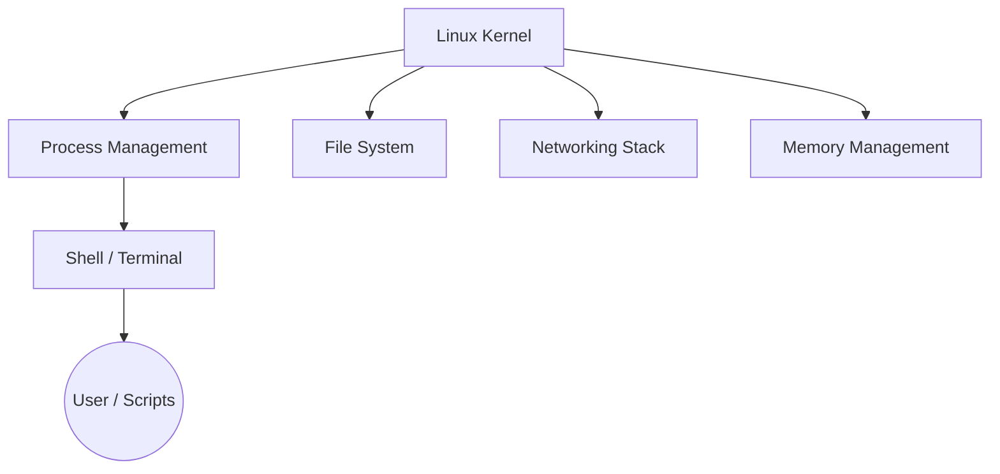

# Operating Systems & Linux Fundamentals

> Status: 🔲 skeleton

## Overview
_TODO: Why Linux fluency underlies almost everything else in this cookbook — most servers, containers, and CI runners are Linux._

## Diagram

## How It Works

### Process Management
- Processes vs threads, PID/PPID
- Foreground/background jobs, signals (SIGTERM, SIGKILL)
- `ps`, `top`/`htop`, `kill`

### File System
- Filesystem hierarchy (`/etc`, `/var`, `/proc`, etc.)
- Permissions (`chmod`, `chown`, octal notation)
- Inodes, mount points

### Terminal & Shell Usage
- Navigating, piping, redirection
- Essential commands: `grep`, `awk`, `sed`, `find`, `xargs`
- Environment variables, `.bashrc`/`.zshrc`

### Virtualization Concepts
- How VMs and containers both rely on kernel features (namespaces, cgroups)

## Common Tools
| Tool | Use Case |
|------|----------|
| `systemd` | Service/process management |
| `journalctl` | Log inspection |
| `strace` / `lsof` | Debugging processes and open files |

## Gotchas / Interview Angle
- Difference between a zombie and an orphan process
- Seed Q: "A process won't die even after `kill`. What do you do next?"

## References
- _TODO_
