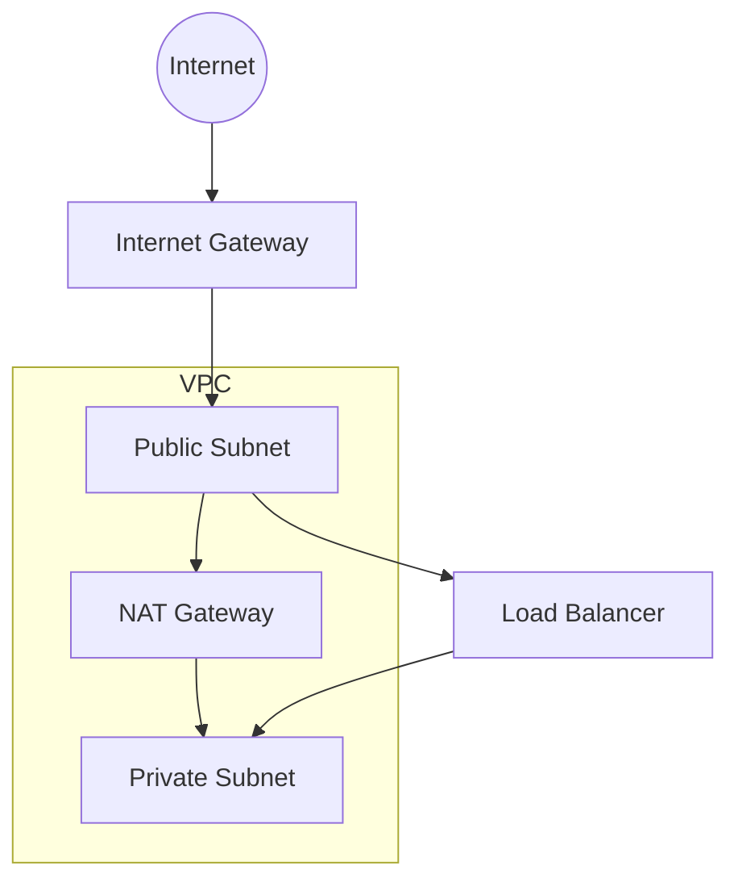

# Networking

> Status: 🔲 skeleton

## Overview
_TODO: Why networking knowledge matters for DevOps (deployments live inside networks; misconfig = outage or breach)._

## Diagram

## How It Works

### Fundamentals
- OSI model vs TCP/IP model (which layers matter day-to-day)
- IP addressing, CIDR notation, subnetting math

### VPCs & Subnets
- Public vs private subnets
- Availability zones and multi-AZ design

### Routing
- Route tables
- Internet Gateway vs NAT Gateway
- VPC peering / transit gateway

### Firewalls & Security
- Security groups (stateful) vs Network ACLs (stateless)
- Bastion hosts / jump boxes

### DNS & Load Balancing
- DNS resolution basics
- Load balancer types (L4 vs L7)

## Common Tools
| Tool | Use Case |
|------|----------|
| VPC (AWS) / VNet (Azure) | Virtual network boundary |
| Terraform | Provisioning network infra |
| Wireshark / tcpdump | Packet-level debugging |

## Gotchas / Interview Angle
- Public subnet ≠ "has a public IP automatically" — common misconception
- Security Group vs NACL statefulness trips people up constantly
- Seed Q: "A service in a private subnet can't reach the internet — walk me through how you'd debug it."

## References
- _TODO_
