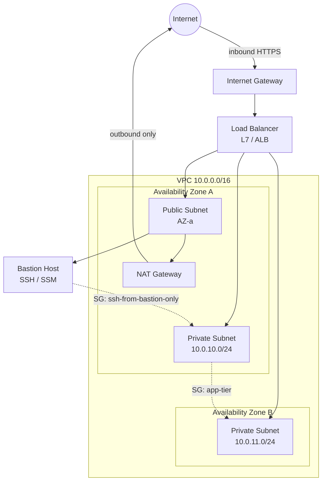

# Networking

> Status: ✅ complete

## Overview

Every deployment you'll ever ship lives inside a network before it lives inside a runtime. A container doesn't fail to "start" so much as it fails to bind a port, resolve a hostname, or reach a dependency across a subnet boundary — and a load balancer doesn't route traffic wrong so much as a route table, a security group, or a DNS record was misconfigured somewhere upstream. For a DevOps engineer, networking isn't a specialist topic you can defer to someone else: it's the layer where "it works on my machine" turns into "it can't reach the database," and where a single overly-permissive rule turns into a security incident.

This chapter covers the practical slice of networking that shows up constantly in DevOps work: addressing and subnetting, how cloud VPCs are actually laid out, how traffic gets routed in and out, how firewalls are enforced at different layers, and how DNS and load balancers tie it all together. The goal isn't to replace a networking degree — it's to give you enough of a mental model that you can read a network diagram, reason about where a request might be dying, and ask the right next question when something can't connect.

## Diagram

The shape to memorize: the **Internet Gateway** is the VPC's only two-way door to the internet. Public subnets have a route to it directly. Private subnets route *outbound* traffic through a **NAT Gateway** sitting in a public subnet — so private workloads can call out (pull a package, hit an API) but nothing from the internet can initiate a connection *in*. The load balancer is the one thing deliberately exposed in front of private compute.

## How It Works

### Fundamentals

The **OSI model** (7 layers: Physical, Data Link, Network, Transport, Session, Presentation, Application) is the academic reference; day-to-day, most DevOps work maps cleanly onto the simpler **TCP/IP model** (Link, Internet, Transport, Application). In practice you'll mostly reason about three layers:

- **Layer 3 (Network/IP)** — addressing and routing. This is where subnets, route tables, and IP-based firewall rules live.
- **Layer 4 (Transport/TCP-UDP)** — ports and connections. Security groups and network load balancers operate here; a Layer 4 device sees "port 443, TCP" but not what's inside the request.
- **Layer 7 (Application/HTTP, gRPC, etc.)** — content-aware routing. Application load balancers, ingress controllers, and API gateways operate here; they can route `/api/*` to one service and `/static/*` to another based on the actual request.

**IP addressing and CIDR** notation is the other prerequisite. An IPv4 address like `10.0.5.12` paired with a prefix like `/24` describes a block of addresses: the `/24` says the first 24 bits are fixed (the network portion) and the remaining 8 bits (256 addresses, 254 usable after the network and broadcast address are reserved) are available for hosts. A `/16` (like `10.0.0.0/16`) gives you 65,536 addresses — typically a whole VPC — which you then carve into smaller `/24`s per subnet. The subnetting math that actually matters day-to-day: **smaller prefix number = bigger block** (`/16` > `/24` > `/28`), and every cloud provider reserves a handful of addresses per subnet (AWS reserves 5) so a `/24` never actually gives you the full 256.

### VPCs & Subnets

A **VPC** (Virtual Private Cloud, or VNet in Azure) is your isolated slice of the cloud provider's network — you define its address range, and everything inside it is invisible to the outside world by default. Within a VPC, you split addresses into **subnets**, and a subnet's "publicness" is entirely a routing decision, not an inherent property:

- A **public subnet** is one whose route table sends `0.0.0.0/0` (all internet-bound traffic) to the Internet Gateway.
- A **private subnet** is one whose route table sends `0.0.0.0/0` to a NAT Gateway (or nowhere at all).

Subnets are also how you get **multi-AZ** (Availability Zone) resilience: each subnet lives in exactly one AZ, so a highly-available design puts at least one public and one private subnet in each of two or more AZs, and load balancers/autoscaling groups span across them. Losing one AZ (a real, semi-regular event) shouldn't take the whole service down.

### Routing

A **route table** is just a list of "if traffic is headed to this CIDR block, send it here" rules, attached to one or more subnets. The two entries that matter most:

- **Internet Gateway (IGW)** — attached once per VPC, provides two-way NAT-free routing between the VPC and the internet. Only subnets that route through it are "public."
- **NAT Gateway** — sits in a public subnet, provides one-way outbound-only internet access for private subnets. It has its own cost (hourly + per-GB processed), which is a genuinely common line item people are surprised by on their cloud bill.

For connecting VPCs to each other, **VPC peering** creates a direct, non-transitive link between two VPCs (peering A↔B and B↔C does *not* give A↔C — that requires a **transit gateway**, which acts as a central routing hub for many VPCs and is the standard choice once you have more than a handful of VPCs to interconnect).

### Firewalls & Security

Two different firewall layers exist in most clouds, and mixing up their behavior is one of the most common sources of "why can't this thing connect" bugs:

- **Security Groups** — attached to individual resources (an instance, a load balancer, an RDS instance). They are **stateful**: if you allow inbound traffic on a connection, the response traffic is automatically allowed back out, regardless of outbound rules. You can only write **allow** rules; there's no explicit deny.
- **Network ACLs (NACLs)** — attached to a subnet, affecting everything inside it. They are **stateless**: you must explicitly allow both the inbound *and* the return outbound traffic, and rules are evaluated in numbered order with explicit allow/deny. Most teams leave the default "allow all" NACL in place and do all their real enforcement at the security group level — NACLs mainly earn their keep for subnet-wide deny rules (e.g., blacklisting a malicious IP range).

For administrative access into private subnets, a **bastion host** (jump box) is a single, tightly-locked-down instance in a public subnet that's the only thing allowed to SSH into private instances — you SSH into the bastion, then hop from there. Increasingly this pattern is being replaced by **SSM Session Manager** (AWS) or equivalent, which needs no open inbound port and no bastion at all, brokering access through the cloud provider's control plane instead.

### DNS & Load Balancing

**DNS resolution**, at a practical level: your client asks a **recursive resolver** (often your ISP's or a public one like 1.1.1.1) to resolve a name; the resolver walks from the root servers → the TLD servers (`.com`) → the domain's **authoritative nameservers**, caching the answer for the record's **TTL** along the way. The record types you'll touch constantly: **A** (name → IPv4), **AAAA** (name → IPv6), **CNAME** (name → another name), and cloud-specific **ALIAS/ANAME** records (which behave like a CNAME but are allowed at a zone apex, e.g. pointing `example.com` itself at a load balancer).

**Load balancers** come in two flavors that map directly to the OSI layers above:

- **L4 (Network Load Balancer)** — routes based on IP/port only, extremely low latency, preserves the client's source IP more easily, good for raw TCP/UDP workloads.
- **L7 (Application Load Balancer)** — terminates and inspects HTTP(S), can route by path/host/header, do TLS termination, and run application-aware health checks (an actual HTTP `GET /health` rather than just a TCP handshake).

Health checks are what actually make a load balancer useful: it continuously probes each backend and stops sending traffic to instances that fail, which is the mechanism behind zero-downtime deploys — a new instance only receives traffic once it starts passing its health check.

## Common Tools

| Tool | Use Case |
|------|----------|
| VPC (AWS) / VNet (Azure) / VPC (GCP) | Virtual network boundary and subnetting |
| Terraform / Pulumi | Provisioning network infra as code |
| `dig` / `nslookup` | DNS record lookups and debugging |
| `curl -v` | Inspecting the HTTP-level handshake, redirects, TLS |
| `traceroute` / `mtr` | Tracing the hop-by-hop path to a host |
| `tcpdump` / Wireshark | Packet-level capture and inspection |
| AWS VPC Reachability Analyzer | Automated path analysis between two resources |
| `iptables` / `nftables` | Host-level packet filtering on Linux |

## Gotchas / Interview Angle

- **"Public subnet" doesn't mean "has a public IP."** It only means the subnet's route table points at an Internet Gateway. An instance in a public subnet with no public/Elastic IP assigned is still unreachable from the internet — and conversely, giving an instance in a *private* subnet a public IP does nothing useful, because its subnet has no route to the IGW.
- **Security Group vs NACL statefulness** is the single most common thing candidates get backwards. If you only remember one thing: SGs auto-allow return traffic, NACLs do not — so a NACL that allows inbound 443 but forgets the outbound ephemeral port range (1024–65535) will silently break responses.
- **NAT Gateways cost money per GB processed**, not just per hour — a surprising line item on a first cloud bill for teams routing a lot of egress traffic through one.
- **VPC peering isn't transitive.** Assuming it is (and being surprised when A can't reach C through B) is a very common design mistake at the point a company's VPC count grows past two or three.
- Seed Q: *"A service running in a private subnet suddenly can't reach the internet — walk me through how you'd debug it."* A strong answer works outward in layers: confirm the instance's security group allows the outbound traffic → check the private subnet's route table has a route to a NAT Gateway → confirm the NAT Gateway itself is healthy and in a *public* subnet with its own route to the IGW → check the NACL on both the private and public subnets allow the traffic in both directions → only then start looking at DNS or the destination service itself.
- Seed Q: *"What's the difference between an ALB and an NLB, and when would you pick one over the other?"* Good answer hits: NLB for raw TCP/UDP, extreme low latency, or when you need to preserve client source IP without proxy protocol; ALB when you need path/host-based routing, TLS termination, or WAF integration for HTTP(S) traffic.

## References

- [RFC 791 — Internet Protocol](https://www.rfc-editor.org/rfc/rfc791)
- [RFC 793 — Transmission Control Protocol](https://www.rfc-editor.org/rfc/rfc793)
- [AWS: How Amazon VPC works](https://docs.aws.amazon.com/vpc/latest/userguide/how-it-works.html)
- [AWS: Security Groups vs Network ACLs](https://docs.aws.amazon.com/vpc/latest/userguide/vpc-security-comparison.html)
- [Cloudflare Learning Center: What is DNS?](https://www.cloudflare.com/learning/dns/what-is-dns/)
- [Julia Evans — networking zines and blog posts](https://jvns.ca/categories/networking/)
