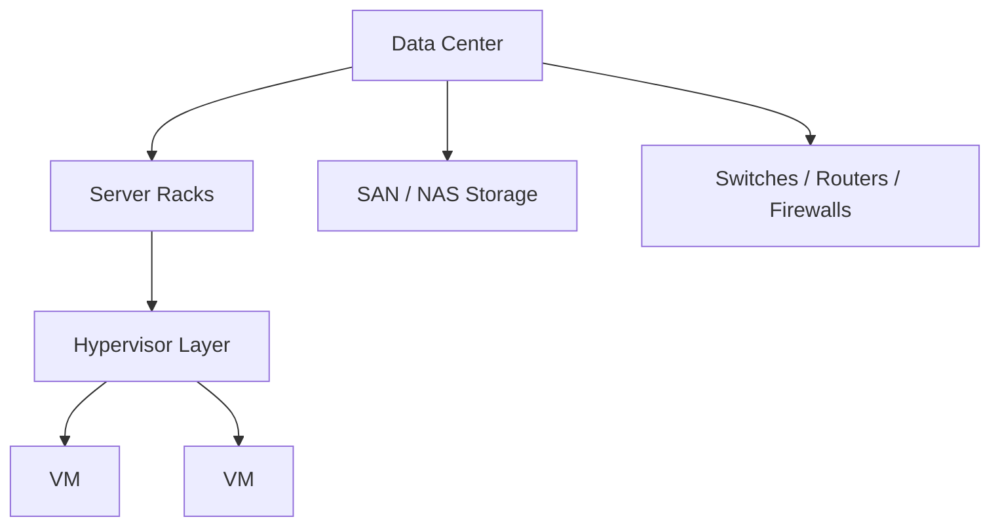

# On-Premise Infrastructure

> Status: 🔲 skeleton

## Overview
_TODO: What "on-prem" means today, and why it still matters even in a cloud-first world (compliance, latency, cost at scale)._

## Diagram

## How It Works

### Physical Layer
- Servers, racks, power (PDUs), cooling
- Redundancy: RAID, redundant power supplies

### Virtualization
- Hypervisors: Type 1 (bare-metal) vs Type 2 (hosted)
- VMware, Hyper-V, KVM/Proxmox

### Storage
- SAN vs NAS vs DAS
- Storage protocols: iSCSI, NFS, Fibre Channel

### On-Prem vs Cloud Trade-offs
- CapEx vs OpEx
- Control & compliance vs elasticity & speed
- Hybrid approaches

## Common Tools
| Tool | Use Case |
|------|----------|
| VMware vSphere | Enterprise virtualization |
| Proxmox | Open-source virtualization |
| Nagios / Zabbix | On-prem monitoring |

## Gotchas / Interview Angle
- Knowing *why* a company would still choose on-prem is often more valuable than knowing cloud
- Seed Q: "When would you recommend on-prem over cloud, and why?"

## References
- _TODO_
