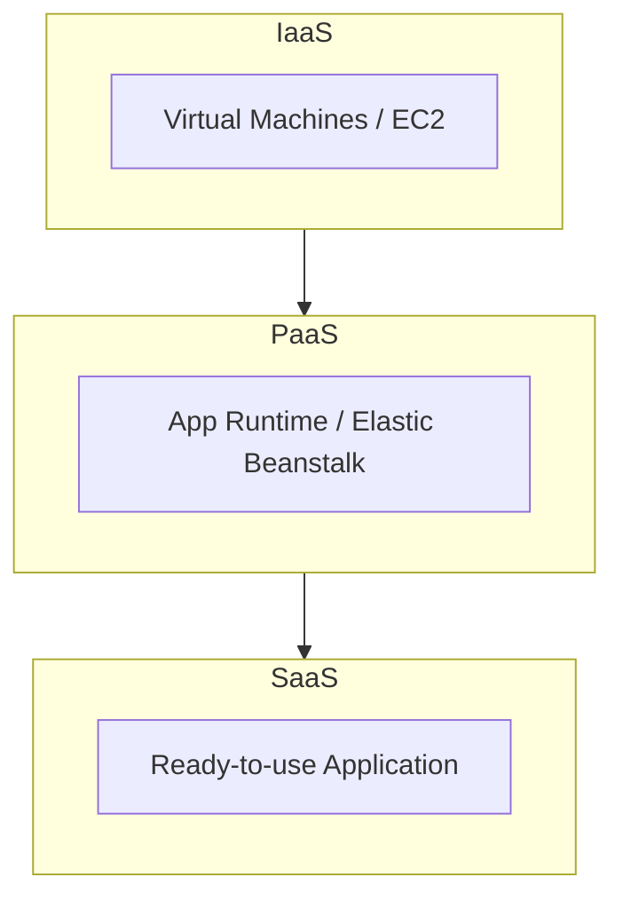

# Cloud Infrastructure

> Status: 🔲 skeleton

## Overview
_TODO: What "the cloud" actually is (someone else's data center + APIs), and the service model spectrum._

## Diagram

## How It Works

### Service Models
- IaaS / PaaS / SaaS — who manages what (draw the "responsibility staircase")
- Shared Responsibility Model (security especially)

### Core Services (map across providers)
| Category | AWS | Azure | GCP |
|----------|-----|-------|-----|
| Compute | EC2 | Virtual Machines | Compute Engine |
| Storage | S3 | Blob Storage | Cloud Storage |
| Managed DB | RDS | Azure SQL | Cloud SQL |
| Serverless | Lambda | Functions | Cloud Functions |

### Regions & Availability Zones
- Why multi-AZ / multi-region design exists

## Common Tools
| Tool | Use Case |
|------|----------|
| AWS CLI / Console | Direct management |
| Terraform | Multi-cloud provisioning |
| Cost Explorer / Azure Cost Management | Cost visibility |

## Gotchas / Interview Angle
- Confusing IaaS/PaaS/SaaS boundaries (e.g., "is Lambda PaaS or serverless as its own category?")
- Seed Q: "Explain the shared responsibility model — what's on you vs the cloud provider?"

## References
- _TODO_
