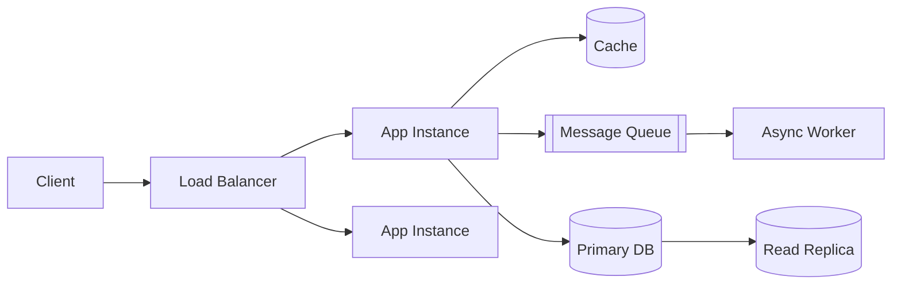

# Cloud Design Patterns

> Status: 🔲 skeleton

## Overview
_TODO: Recurring architectural patterns for building resilient, scalable cloud systems._

## Diagram

## How It Works

### Resilience Patterns
- Circuit breaker
- Retry with backoff
- Bulkhead isolation

### Scalability Patterns
- Horizontal vs vertical scaling
- Caching strategies (cache-aside, write-through)
- Queue-based load leveling

### Data Patterns
- CQRS
- Event sourcing (brief overview)
- Read replicas / sharding

## Common Tools
| Tool | Use Case |
|------|----------|
| Redis / Memcached | Caching |
| SQS / RabbitMQ / Kafka | Queuing & messaging |
| Istio / Envoy | Circuit breaking, retries at the mesh level |

## Gotchas / Interview Angle
- Confusing a circuit breaker with a simple retry — they solve different problems
- Seed Q: "A downstream dependency is failing intermittently. What pattern(s) would you apply?"

## References
- _TODO_
