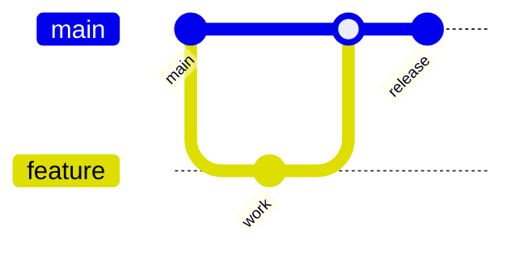

# Version Control

> Status: 🔲 skeleton

## Overview
_TODO: Git as the single source of truth for code AND increasingly for config/infra (see GitOps later)._

## Diagram

## How It Works

### Core Git Concepts
- Commits, branches, merges, rebases
- Staging area vs working directory

### Branching Strategies
- GitFlow (feature/develop/release/hotfix)
- Trunk-based development
- Which one fits which team size/velocity

### Collaboration Patterns
- Pull requests / code review
- Merge conflicts — causes and resolution

## Common Tools
| Tool | Use Case |
|------|----------|
| Git | Version control engine |
| GitHub / GitLab / Bitbucket | Hosting + collaboration |

## Gotchas / Interview Angle
- Merge vs rebase — know the trade-offs, not just the commands
- Seed Q: "Trunk-based vs GitFlow — which would you pick for a team doing daily deploys, and why?"

## References
- _TODO_
