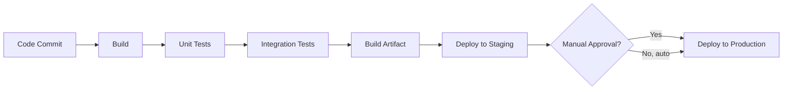

# CI/CD

> Status: 🔲 skeleton

## Overview
_TODO: CI vs CD vs Continuous Deployment — the distinctions people blur together._

## Diagram

## How It Works

### CI vs CD vs Continuous Deployment
- Where each stops (build validated → always deployable → auto-deployed)

### Pipeline Stages
- Build, test, package, deploy
- Artifact management/repositories

### Pipeline Design
- Parallel vs sequential stages
- Fail-fast principles

## Common Tools
| Tool | Use Case |
|------|----------|
| GitHub Actions | Pipeline automation, tightly coupled to GitHub |
| Jenkins | Highly customizable, self-hosted |
| GitLab CI | Integrated with GitLab |
| CircleCI | Cloud-native CI/CD |

## Gotchas / Interview Angle
- "Continuous Delivery" vs "Continuous Deployment" is a classic trick question
- Seed Q: "Design a CI/CD pipeline for a microservice — what stages, what gates?"

## References
- _TODO_
