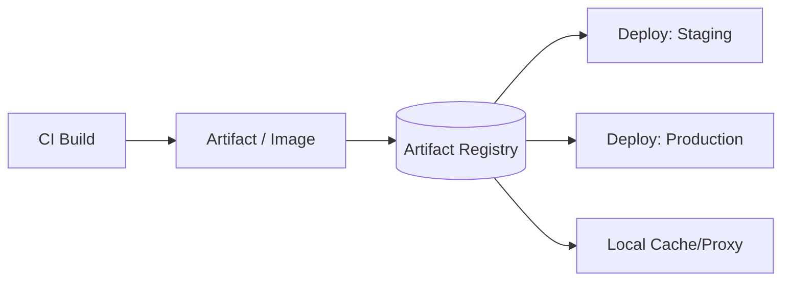

# Artifact Management

> Status: 🔲 skeleton

## Overview
_TODO: What build artifacts are (jars, binaries, container images, packages) and why they need a managed home between "built" and "deployed."_

## Diagram

## How It Works

### Why a Registry, Not Just a File Share
- Versioning, immutability, retention policies
- Security scanning at rest

### Types of Artifacts
- Container images (OCI format)
- Language packages (npm, PyPI, Maven)
- Generic binaries

### Promotion Flow
- Build once, promote the same artifact across environments (vs rebuilding per environment)

## Common Tools
| Tool | Use Case |
|------|----------|
| Docker Hub / GHCR / ECR | Container image registries |
| JFrog Artifactory | Universal artifact management |
| Sonatype Nexus | Multi-format artifact repository |

## Gotchas / Interview Angle
- Rebuilding an artifact per environment instead of promoting the same one (breaks "what you tested is what you ship")
- Seed Q: "Why is 'build once, deploy many times' considered a best practice?"

## References
- _TODO_
