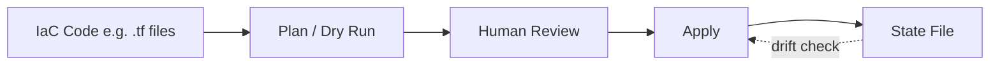

# Infrastructure as Code (IaC)

> Status: 🔲 skeleton

## Overview
_TODO: Treating infra like software — version-controlled, reviewable, reproducible._

## Diagram

## How It Works

### Declarative vs Imperative
- Terraform (declarative) vs scripted provisioning (imperative)

### State Management
- What Terraform state is, why it matters, remote state/locking

### Drift Detection
- What happens when reality diverges from code

## Common Tools
| Tool | Use Case |
|------|----------|
| Terraform | Multi-cloud provisioning |
| Pulumi | IaC using general-purpose languages |
| CloudFormation | AWS-native IaC |

## Gotchas / Interview Angle
- Terraform state file conflicts in team settings — how to handle
- Seed Q: "Someone manually changed a resource that Terraform manages. What happens on the next `terraform apply`, and how do you fix it?"

## References
- _TODO_
