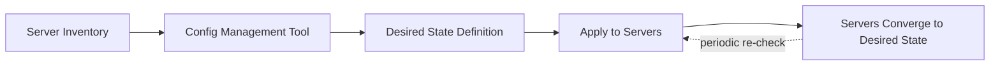

# Configuration Management

> Status: 🔲 skeleton

## Overview
_TODO: IaC provisions *what exists*; configuration management ensures *what's installed and configured on it* stays consistent. Often confused with IaC — worth a dedicated page on the distinction._

## Diagram

## How It Works

### Push vs Pull Models
- Ansible (push, agentless, SSH-based)
- Chef/Puppet (pull, agent-based, periodic convergence)

### Idempotent Configuration
- Ensuring repeated runs don't cause unwanted side effects

### IaC vs Config Management
- Terraform provisions the VM; Ansible configures what's on it — where the line blurs in practice

## Common Tools
| Tool | Use Case |
|------|----------|
| Ansible | Agentless, YAML-based automation |
| Chef | Ruby DSL, agent-based |
| Puppet | Declarative, agent-based |

## Gotchas / Interview Angle
- "Isn't Ansible the same as Terraform?" — no, and explaining why is a common interview moment
- Seed Q: "When would you reach for Ansible instead of (or alongside) Terraform?"

## References
- _TODO_
