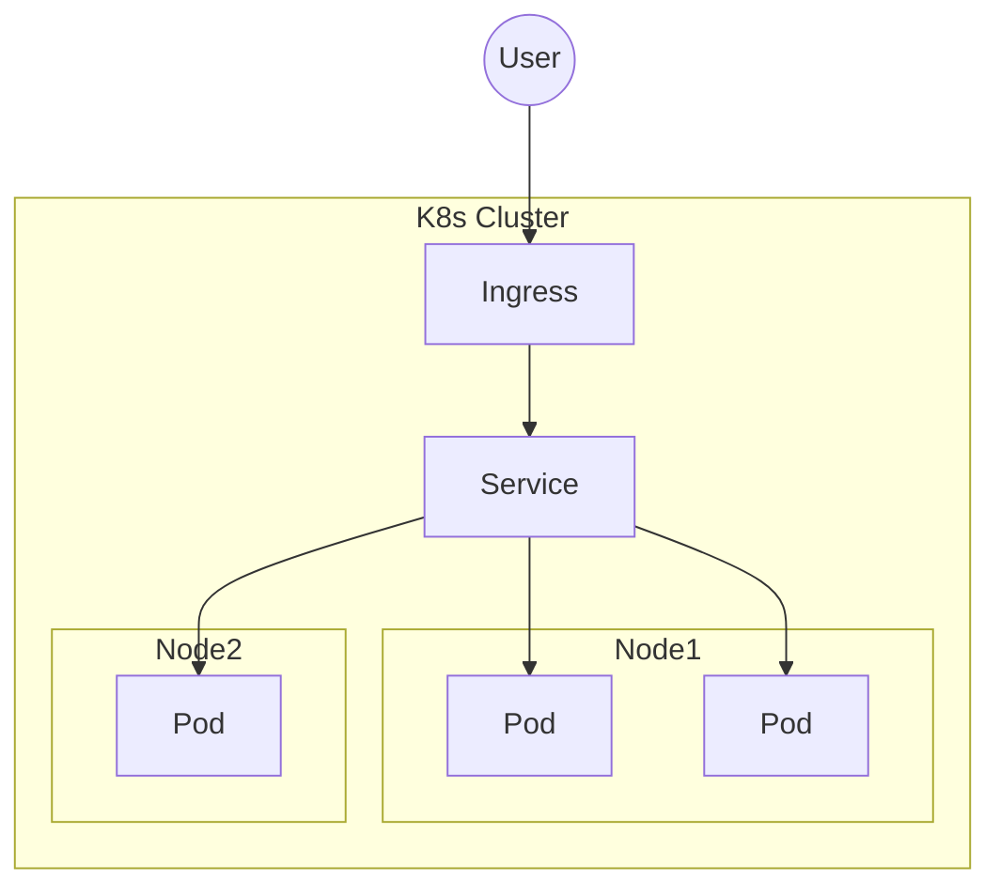

# Containers & Orchestration

> Status: 🔲 skeleton

## Overview
_TODO: Containers solve "works on my machine"; orchestration solves "works reliably at scale."_

## Diagram

## How It Works

### Containers
- Images vs containers
- Dockerfile basics, layers, caching

### Kubernetes Core Objects
- Pods, Deployments, ReplicaSets
- Services (ClusterIP, NodePort, LoadBalancer)
- Ingress
- ConfigMaps & Secrets

### Scaling & Healing
- Horizontal Pod Autoscaler
- Liveness/readiness probes, self-healing

## Common Tools
| Tool | Use Case |
|------|----------|
| Docker | Containerization |
| Kubernetes | Orchestration |
| Helm | K8s package management |

## Gotchas / Interview Angle
- Pod vs container vs node — get the hierarchy exactly right
- Seed Q: "A pod keeps crash-looping. Walk me through how you'd debug it."

## References
- _TODO_
