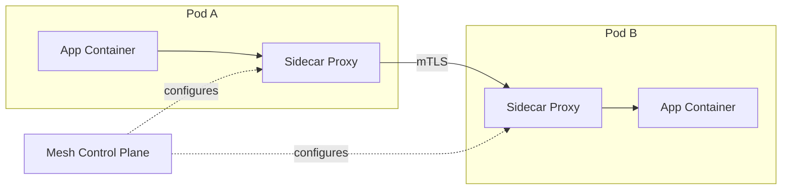

# Service Mesh

> Status: 🔲 skeleton

## Overview
_TODO: What a service mesh adds on top of Kubernetes networking — traffic control, observability, and security between services without changing application code._

## Diagram

## How It Works

### Sidecar Pattern
- A proxy injected alongside each service instance to intercept traffic

### Capabilities
- Traffic management (canary, retries, timeouts, circuit breaking)
- Security (mutual TLS between services)
- Observability (automatic metrics/traces for service-to-service calls)

## Common Tools
| Tool | Use Case |
|------|----------|
| Istio | Full-featured service mesh |
| Linkerd | Lightweight, simpler alternative |
| Envoy | The proxy underlying many meshes |

## Gotchas / Interview Angle
- Adding a mesh purely for "traffic management" when a simpler ingress/API gateway would do — know when it's overkill
- Seed Q: "What problems does a service mesh solve that Kubernetes Services alone don't?"

## References
- _TODO_
