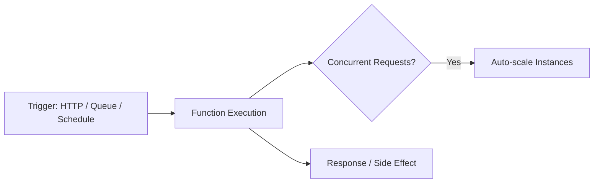

# Serverless Computing

> Status: 🔲 skeleton

## Overview
_TODO: "Serverless" doesn't mean no servers — it means the provider manages them and you pay per execution._

## Diagram

## How It Works

### Function-as-a-Service (FaaS)
- Event-driven execution model
- Cold starts vs warm starts

### When It Fits
- Spiky/unpredictable traffic, event-driven workloads
- When it doesn't: long-running processes, heavy stateful workloads

### Cost Model
- Pay-per-invocation vs pay-per-uptime

## Common Tools
| Tool | Use Case |
|------|----------|
| AWS Lambda | Event-driven functions on AWS |
| Azure Functions | Same, on Azure |
| Google Cloud Functions | Same, on GCP |

## Gotchas / Interview Angle
- Cold start latency and how to mitigate it (provisioned concurrency, keep-warm pings)
- Seed Q: "When would you NOT choose serverless for a workload?"

## References
- _TODO_
