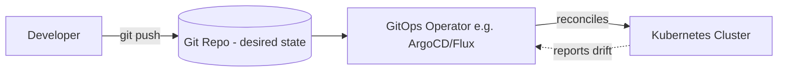

# GitOps

> Status: 🔲 skeleton

## Overview
_TODO: Using Git as the single source of truth for declarative infrastructure and application config — the cluster continuously reconciles to match what's in Git._

## Diagram

## How It Works

### Push vs Pull Deployment
- Traditional CI pushes changes to the cluster
- GitOps: an in-cluster operator pulls and reconciles from Git

### Core Principles
- Git as single source of truth
- Declarative desired state
- Automated drift correction

## Common Tools
| Tool | Use Case |
|------|----------|
| ArgoCD | Kubernetes-native GitOps operator |
| Flux | Lightweight GitOps operator |

## Gotchas / Interview Angle
- GitOps vs traditional CI/CD push-deploy — know the actual mechanical difference, not just "it uses Git"
- Seed Q: "How does GitOps handle someone manually `kubectl edit`-ing a resource in the cluster?"

## References
- _TODO_
