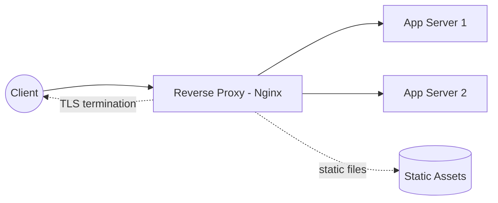

# Web Server Setup

> Status: 🔲 skeleton

## Overview
_TODO: What a web/reverse-proxy server actually does in front of your application, and why almost nothing goes straight to the app process._

## Diagram

## How It Works

### Reverse Proxy Responsibilities
- TLS termination
- Load balancing across app instances
- Serving static assets directly
- Request buffering, rate limiting, caching

### Common Configurations
- Nginx `server` blocks, `location` routing
- Apache virtual hosts

## Common Tools
| Tool | Use Case |
|------|----------|
| Nginx | Reverse proxy, load balancer, static serving |
| Apache HTTPD | Traditional web server |
| Caddy | Automatic HTTPS, simpler config |

## Gotchas / Interview Angle
- Why you almost never expose an app server (e.g., Node/Gunicorn) directly to the internet
- Seed Q: "Explain what happens between a browser request and your app code, step by step."

## References
- _TODO_
