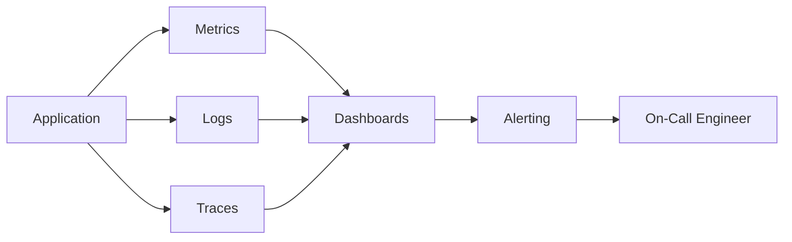

# Monitoring & Observability

> Status: 🔲 skeleton

## Overview
_TODO: Monitoring tells you something is wrong; observability helps you understand why._

## Diagram

## How It Works

### The Three Pillars
- Metrics (time-series numbers)
- Logs (discrete events)
- Traces (request path across services)

### SLIs, SLOs, SLAs
- Service Level Indicator → Objective → Agreement (chain of definitions)
- Error budgets

### Alerting Best Practices
- Alert fatigue and how to avoid it
- Actionable vs informational alerts

## Common Tools
| Tool | Use Case |
|------|----------|
| Prometheus | Metrics collection |
| Grafana | Dashboards/visualization |
| ELK / EFK stack | Log aggregation |
| Jaeger / Zipkin | Distributed tracing |

## Gotchas / Interview Angle
- Confusing SLI/SLO/SLA in interviews is very common — nail the definitions
- Seed Q: "Your error budget is nearly exhausted for the month. What do you do?"

## References
- _TODO_
