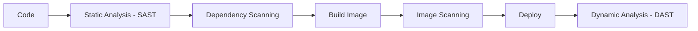

# Security & DevSecOps

> Status: 🔲 skeleton

## Overview
_TODO: "Shift left" — security as part of the pipeline, not a gate at the end._

## Diagram

## How It Works

### Secrets Management
- Why secrets shouldn't live in code/config
- Vault, AWS Secrets Manager, sealed secrets

### Identity & Access Management
- Principle of least privilege
- Roles vs users vs policies

### Scanning
- SAST vs DAST vs SCA (dependency scanning)
- Container image scanning

## Common Tools
| Tool | Use Case |
|------|----------|
| HashiCorp Vault | Secrets management |
| Trivy / Snyk | Vulnerability & dependency scanning |
| OPA / Gatekeeper | Policy enforcement in K8s |

## Gotchas / Interview Angle
- Hardcoded secrets in Git history — how to remediate (not just prevent)
- Seed Q: "A secret got committed to a public repo. Walk me through your response."

## References
- _TODO_
