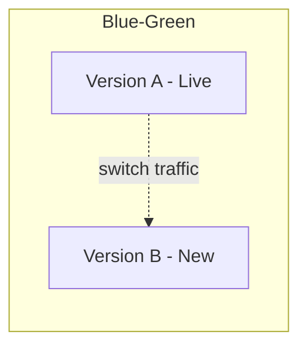

# Release Strategies

> Status: 🔲 skeleton

## Overview
_TODO: Decoupling "deploy" from "release" — getting code to production safely and reversibly._

## Diagram

_TODO: Add a second diagram for canary releases (gradual traffic shift)._

## How It Works

### Blue-Green Deployment
- Two identical environments, instant switch, easy rollback

### Canary Releases
- Gradual traffic shift to new version, monitor, expand or roll back

### Feature Flags
- Decouple deployment from release
- Kill switches for risky features

### Rollback Strategies
- Automated rollback triggers (based on error rate/metrics)

## Common Tools
| Tool | Use Case |
|------|----------|
| LaunchDarkly / Unleash | Feature flag management |
| Argo Rollouts / Flagger | Progressive delivery in K8s |

## Gotchas / Interview Angle
- Canary ≠ A/B testing (different goals — safety vs product experimentation)
- Seed Q: "Design a rollout strategy for a risky database migration."

## References
- _TODO_
